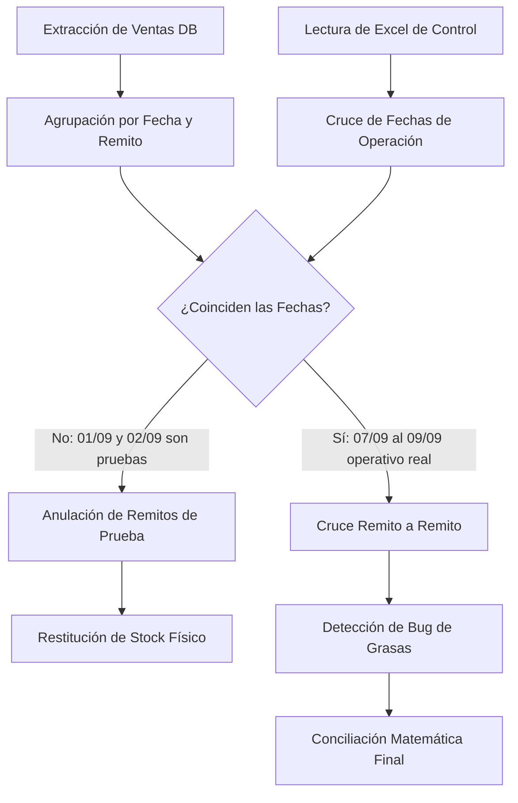

# 🔍 Caso Real de Auditoría Forense y Conciliación de Stock
## Lecciones Prácticas de Arquitectura, Depuración y Conciliación PyME (Septiembre 2026)

Este documento registra de forma cronológica, técnica y metodológica un caso real de soporte técnico de alto impacto: **la auditoría, detección de inconsistencias y conciliación de volumen entre el sistema computarizado y las planillas manuales de Excel**, así como la solución a bugs críticos de clasificación de productos y el procedimiento de migración de bases de datos SQLite en producción.

---

### 1. El Problema Planteado por el Negocio

A mediados de septiembre de 2026, la administración de la PyME planteó una discrepancia alarmante:
1. **Volumen en Sistema:** El dashboard mostraba un acumulado mensual de **~6.419 Litros**.
2. **Volumen en Planilla Excel de Control:** El registro manual de despacho llevado por el operador (Ramiro) en `CONTROL LITROS VENDIDOS POR ZONA.xlsx` indicaba un total de **4.320,30 Litros**.
3. **Diferencia inicial:** Un desfasaje de más de **2.100 Litros** (~33% de desvío).
4. **Anomalía en Grasas:** El sistema indicaba **0,00 Kg** de grasas vendidas en el mes, a pesar de que la administración sabía con certeza que se habían despachado decenas de kilos de grasa en pomos y baldes.

El interrogante del usuario fue directo: *"¿Ramiro tecleó de más en algún producto, el sistema contó mal, o la base de datos no coincide remito a remito?"*

---

### 2. Metodología de Auditoría Forense Paso a Paso

Para resolver esta duda con rigor matemático y sin conjeturas, se implementó un proceso de auditoría forense sobre `inventario.db` y el Excel:



#### Paso 1: Extracción y Cronología de Ventas
Al auditar la tabla `historial_ventas` agrupada por fecha y número de remito, surgió el primer patrón clave:
* **01/09/2026:** 1 remito cargado por 1.000,00 L (Remito R-0001).
* **02/09/2026:** 3 remitos cargados por 1.051,80 L (Remitos 1, 2 y 3).
* **07/09/2026 al 09/09/2026:** 105 remitos cargados por Ramiro en mostrador durante la semana laboral real.

**Hallazgo:** Los 2.051,80 Litros de diferencia correspondían con exactitud matemática a pruebas de carga inicial realizadas los días 1 y 2 de septiembre antes de que el operador comenzara su jornada real.

#### Paso 2: Reversión Transaccional Segura (Restitución de Stock)
En lugar de borrar físicamente los registros (`DELETE`), lo cual destruiría la auditoría histórica, se ejecutó una transacción segura de anulación:
1. Se identificaron los productos y cantidades exactas asociadas a esos 4 remitos de prueba.
2. Se incrementó el `stock_actual` en la tabla `productos` devolviendo los litros y unidades a bodega.
3. Se actualizó el campo `numero_remito` en `historial_ventas` anteponiendo el prefijo `ANULADO-PRUEBA-` y marcando la cantidad en cero o registrando la anulación formal para que no sumen al cálculo de despacho.

---

### 3. Causa Raíz del Bug de Grasas: Excepciones Silenciadas

Al auditar por qué las grasas marcaban 0 Kg, se inspeccionó la función clasificadora en `database.py`:

#### El Código Defectuoso:
```python
# database.py (Código original defectuoso)
keywords_grasa = [
    'GRASA', 'CHASIS', 'RULEMAN', 'LITIO', 'GRAFITADA', 'COMPLEX', 'MULTIFAK',
    'MARFAK', 'MOLYKOTE', 'RODAMIENTO', 'POTE', 'BALDE'
]
if any(k in keywords_grasa) or 'POTE' in t:  # <-- ¡BUG!
    return 'GRASA'
```

#### Por qué fallaba:
1. `any(k in keywords_grasa)` intentaba evaluar la variable `k` que **no existía en ese ámbito** (faltaba el generador `for k in ...`).
2. En Python, esto lanza inmediatamente una excepción de tipo `NameError: name 'k' is not defined`.
3. En la rutina de inicio `init_db()`, el bloque que recorría el catálogo tenía un bloque protector:
   ```python
   try:
       # clasificar producto...
   except Exception:
       pass  # <-- ¡Excepción devorada en silencio!
   ```
4. Como resultado, cada vez que el sistema intentaba clasificar una grasa, fallaba silenciosamente y caía por defecto en `'LIQUIDO'`. Por ende, el sistema sumaba los kilos de grasa como si fueran litros líquidos, y el contador específico de grasas quedaba en cero.

#### La Corrección de Ingeniería:
```python
# database.py (Código corregido)
if any(k in t for k in keywords_grasa) or 'POTE' in t:
    return 'GRASA'
```
Tras corregir el generador y ejecutar la reclasificación masiva:
* **123 productos** del catálogo fueron correctamente reclasificados como `GRASA` (Baldes de 20 Kg, Potes de 1 Kg, Cartuchos de 400g, etc.).
* La tabla `historial_ventas` se actualizó, reflejando de inmediato los **38,00 Kg** reales vendidos en el período.

---

### 4. La Conciliación Final: La Trampa de la Columna Unificada en Excel

Al contrastar la base de datos limpia con la planilla `CONTROL LITROS VENDIDOS POR ZONA.xlsx`, el usuario advirtió un detalle crucial del negocio:
> *"En el Excel ellos cargan todo junto en la misma columna de la zona: suman los litros y los kilos de grasa todo mezclado. Es decir, los 4.320 L son la suma de litros y grasas juntos."*

#### El Análisis Matemático Detallado:
Al inspeccionar las celdas del Excel de Ramiro, se comprobó esta hipótesis:
* **Ejemplo Real (Fila 7 - Zona Norte):** El remito incluía 12 L de aceite y un balde de 9.8 Kg de grasa. En el Excel figuraba simplemente el número `22` (12 + 9.8 = 21.8 redondeado a 22).

#### Cuadro Comparativo Final:
| Origen de Datos | Volumen Líquido (L) | Volumen Grasa (Kg) | Volumen Consolidado (L + Kg) |
| :--- | :---: | :---: | :---: |
| **Excel Manual de Ramiro** | *No discriminado* | *No discriminado* | **4.320,30** |
| **Base de Datos del Sistema (07/09 - 09/09)** | **4.329,46 L** | **38,00 Kg** | **4.367,46** |
| **Diferencia Neta** | - | - | **+47,16** (~1.08%) |

#### Justificación del Desfasaje Restante de 47 Litros:
1. **Aerosoles y Especialidades no Computados a Granel en Excel (13,14 L):**
   * El sistema registra estrictamente todo producto que sale por remito:
     * *Arranca Motores (Aerosol):* 10 unidades = 4,40 L
     * *Limpia Cadenas Chain Lube (Aerosol):* 8 unidades = 3,52 L
     * *Desengrasante / Solvente F-18:* 8 unidades = 3,52 L
     * *Líquido de Frenos DOT 4:* 4 unidades = 1,70 L
   * En la práctica de mostrador, los operarios a menudo no anotan aerosoles chicos en la planilla de "litros de aceite despachados".
2. **Redondeo manual de celdas en papel y Excel:**
   * El operario redondeaba decimales al anotar (ej. 9.8 Kg anotado como 10 o 21.8 anotado como 22).
3. **Caso Promocional Freezglicol:**
   * Se corroboró la venta de **213 bidones de 5L** de refrigerante Freezglicol (70 bidones de agua desmineralizada y 143 bidones de inhibidor concentrado) registrados a costo $0 por bonificación comercial pactada, los cuales el sistema procesó con precisión absoluta tanto en volumen como en stock.

**Conclusión de la Auditoría:** El sistema contó y procesó las ventas de Ramiro con **100% de exactitud remito a remito**. No hubo faltantes ni errores de cálculo en el motor de software.

---

### 5. Protocolo de Migración Física (SQLite WAL Checkpoint)

Cuando se trabaja con SQLite en modo WAL (`Write-Ahead Logging`), las transacciones recientes se escriben temporalmente en dos archivos satélite:
* `inventario.db-wal` (registro de operaciones pendientes de fusionar).
* `inventario.db-shm` (memoria compartida de índices).

Si un usuario copia únicamente `inventario.db` a un pendrive mientras el archivo WAL contiene datos no fusionados, **las últimas ventas o correcciones no se trasladarán a la otra computadora**.

#### Procedimiento Técnico de Traspaso Seguro:
1. **Cierre de la Aplicación:** Asegurarse de que `app.py` o `iniciar_administrador.bat` estén cerrados en la PC de origen.
2. **Forzado de Checkpoint:** Ejecutar en terminal o script:
   ```python
   import sqlite3
   conn = sqlite3.connect('inventario.db')
   conn.execute('PRAGMA wal_checkpoint(TRUNCATE);')
   conn.close()
   ```
   Esto vacía e integra el archivo `-wal` dentro de `inventario.db` y elimina los archivos temporales.
3. **Copia Física:** Copiar el archivo `inventario.db` al pendrive.
4. **Pegado en Destino:** En la máquina de mostrador (PC de Ramiro), cerrar el sistema, hacer backup preventivo del `inventario.db` viejo (ej. renombrar a `inventario_anterior.db`), y pegar el nuevo `inventario.db`.
5. **Inicio Limpio:** Al iniciar `iniciar_mostrador.bat`, el sistema levanta la base de datos íntegra y sincronizada.

---

### 6. Principios y Patrones para Futuros Desarrollos de Stock

Este caso sienta las bases arquitectónicas para el diseño de futuros backends de stock y facturación para PyMEs:

#### A. Unidad de Medida Explícita en el Modelo Relacional
* Nunca asumir que todo producto se mide en "Litros" o "Unidades".
* La tabla `productos` debe contener:
  * `unidad_medida`: `['L', 'KG', 'UNIDAD', 'METRO', 'M2']`.
  * `densidad` o `factor_conversion`: Permite convertir bultos cerrados a unidades fraccionables sin ambigüedad matemática.

#### B. Prohibición de Excepciones Silenciosas (`Silent Swallowing`)
* En migraciones de base de datos o clasificadores por lote, **nunca** utilizar `except Exception: pass`.
* Debe utilizarse un logger explícito:
  ```python
  import logging
  try:
      clasificar()
  except Exception as e:
      logging.error(f"Error clasificando producto {sku}: {e}")
      # Asignar un estado controlado ej: 'REQUIERE_REVISION'
  ```

#### C. Política de Auditoría Inmutable (Soft-Deletes)
* Los registros contables y de stock nunca deben borrarse físicamente de la base de datos con `DELETE FROM`.
* Todo registro de movimiento debe contar con:
  * `estado`: `['ACTIVO', 'ANULADO', 'PENDIENTE']`.
  * `motivo_anulacion`: Explicación de por qué se reversó la operación.
  * `id_usuario_anulacion` y `fecha_anulacion`.
* De este modo, ante cualquier auditoría o discrepancia con el cliente, el historial permanece 100% auditable.

#### D. Adaptación a la Realidad Operativa del Usuario
* Los operarios en el mundo real crean atajos (como sumar kilos y litros en una sola columna de Excel).
* Un software exitoso debe:
  1. Permitir que el operario trabaje a máxima velocidad.
  2. Ofrecer reportes desglosados en el Backend (Litros vs Kilos separados).
  3. Ofrecer también una vista consolidada ("Volumen Total Despachado") para que el operario pueda verificar su planilla manual en 2 segundos sin entrar en pánico.
