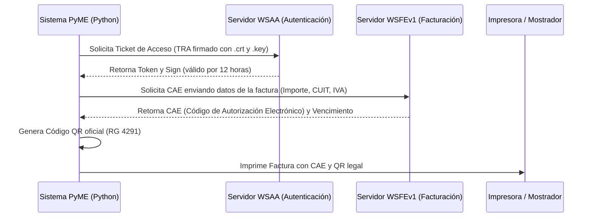

# 🔌 Hoja de Ruta e Integraciones Futuras
## Blueprint de Extensión: Precios Dinámicos, Remitador Digital, ARCA (ex-AFIP) y Mercado Pago

Este documento funciona como **guía de ingeniería y especificación de arquitectura modular**. Su propósito es dejar la base técnica lista y documentada para que, cuando el cliente o una nueva PyME solicite incorporar **facturación electrónica legal, pasarelas de pago, remitería formal o listas dinámicas de precios**, el equipo de desarrollo pueda implementarlo de inmediato sin reescribir el núcleo del sistema.

---

### 1. Arquitectura Modular Recomendada (Flask Blueprints)

A medida que se agreguen estos módulos avanzados, la arquitectura actual de archivo único (`app.py`) puede subdividirse limpiamente utilizando **Blueprints de Flask** sin perder la simplicidad del despliegue:

```
INVENTORY-SYSTEM-PyME/
│
├── app.py                     # Inicializador central y servidor Flask
├── database.py                # Conexiones SQLite, migraciones y pool WAL
├── modules/                   # Módulos desconectables (Plug & Play)
│   ├── precios/               # Módulo de listas, recargos y descuentos
│   │   ├── __init__.py
│   │   └── routes.py
│   ├── remitos/               # Emisión de remitos y PDFs de despacho
│   │   ├── __init__.py
│   │   ├── routes.py
│   │   └── pdf_generator.py
│   ├── arca/                  # Conexión con WSFE de ARCA (ex-AFIP)
│   │   ├── __init__.py
│   │   ├── client_wsfe.py     # Cliente SOAP con certificado y clave privada
│   │   └── routes.py
│   └── mercadopago/           # Cobros con QR interoperable y terminal Point
│       ├── __init__.py
│       ├── mp_service.py
│       └── webhooks.py
│
├── certs/                     # Certificados digitales de ARCA (.crt y .key)
│   └── .gitignore             # NUNCA subir claves privadas al repositorio
└── docs/                      # Memorias técnicas de ingeniería
```

---

### 2. Módulo de Precios y Márgenes Comerciales

#### Requerimiento Típico:
Manejo de múltiples listas (Costo, Mayorista, Taller/Gremio, Mostrador al Público) y actualización ágil ante inflación.

#### Extensión de Base de Datos:
```sql
-- Nueva tabla para reglas de precios
CREATE TABLE IF NOT EXISTS listas_precios (
    id INTEGER PRIMARY KEY AUTOINCREMENT,
    nombre TEXT NOT NULL,          -- 'MOSTRADOR', 'MAYORISTA', 'GREMIO'
    margen_ganancia REAL DEFAULT 0, -- Porcentaje de recargo sobre costo (ej. 35.0)
    descuento_efectivo REAL DEFAULT 0,
    activo INTEGER DEFAULT 1
);

-- Ampliación de la tabla productos
ALTER TABLE productos ADD COLUMN precio_costo REAL DEFAULT 0;
ALTER TABLE productos ADD COLUMN fecha_actualizacion_precio TIMESTAMP;
```

#### Flujo de Implementación:
1. **Carga Masiva desde Excel:** Interfaz donde el usuario sube la lista del fabricante (como las listas de Gulf/YPF ya incorporadas) y el sistema calcula automáticamente los precios de venta según los márgenes configurados.
2. **Actualización Relativa (%):** Endpoint `/api/precios/ajuste_porcentual` que permite aumentar una marca o categoría en un `X%` con un solo clic.

---

### 3. Módulo de Remitos y Talonarios Digitales

#### Requerimiento Típico:
Generar un remito formal numerado (R o X), con control estricto de correlatividad, apto para imprimir en hoja A4 o formato ticket comanda (térmica de 80mm).

#### Extensión de Base de Datos:
```sql
CREATE TABLE IF NOT EXISTS remitos (
    id INTEGER PRIMARY KEY AUTOINCREMENT,
    punto_venta INTEGER DEFAULT 1,     -- 0001
    numero_correlativo INTEGER NOT NULL, -- 00000123
    letra TEXT DEFAULT 'R',            -- 'R' o 'X'
    cliente_nombre TEXT,
    cliente_cuit TEXT,
    cliente_direccion TEXT,
    transporte TEXT,
    observaciones TEXT,
    total_volumen REAL,
    total_importe REAL,
    fecha TIMESTAMP DEFAULT CURRENT_TIMESTAMP,
    estado TEXT DEFAULT 'EMITIDO',     -- 'EMITIDO', 'ANULADO'
    UNIQUE(punto_venta, numero_correlativo)
);
```

#### Generación de Documentos (PDF o Ticket):
* **Librerías recomendadas:** `ReportLab` (para PDF vectorial formal con logotipo) o `escpos` (para impresión directa y veloz en impresoras térmicas de mostrador por USB).
* Al confirmar la venta en el mostrador, se genera el número correlativo de remito atómicamente dentro de la misma transacción de SQLite donde se descuenta el stock.

---

### 4. Módulo ARCA (ex-AFIP): Facturación Electrónica Legal

#### ¿Cómo Funciona la Facturación Electrónica en Argentina?
Para emitir Facturas A, B, C o Notas de Crédito, el software debe comunicarse con los servidores de **ARCA (Agencia de Recaudación y Control Aduanero)** mediante Web Services SOAP:



#### Requisitos Previos para el Cliente (PyME):
1. **Certificado Digital:** Generado desde la web de ARCA con CUIT y Clave Fiscal del titular.
2. **Punto de Venta de Web Services:** Habilitar un punto de venta específico (ej. PV 0002) para "Factura Electrónica - Web Services".

#### Librerías Python Recomendadas:
* `PyAfipWs` o implementar cliente directo vía `zeep` (cliente SOAP de alto rendimiento en Python).
* Generación de QR oficial: Cadena JSON con formato exigido por ARCA codificada en Base64 y convertida a imagen con la librería `qrcode` de Python.

---

### 5. Módulo Mercado Pago: Cobros con QR y Point

#### A. Cobro con QR Dinámico (Interoperable - Transferencias 3.0)
* **SDK Oficial:** `mercadopago` (`pip install mercadopago`).
* **Flujo:**
  1. El vendedor marca el remito/ticket por `$15.400`.
  2. El backend genera una orden de pago vía API:
     ```python
     import mercadopago
     sdk = mercadopago.SDK("ACCESS_TOKEN_DEL_CLIENTE")
     payment_data = {
         "transaction_amount": float(monto),
         "description": f"Venta Mostrador - Remito {nro_remito}",
         "payment_method_id": "pix_o_qr"
     }
     ```
  3. En la pantalla de mostrador se dibuja el código QR al instante.
  4. El cliente escanea con cualquier billetera virtual (Mercado Pago, Cuenta DNI, BNA+, MODO, Galicia, Santander, etc.).
  5. **Webhook de confirmación:** Mercado Pago notifica en milisegundos al endpoint `/api/mp/webhook`; la pantalla cambia automáticamente a verde *"¡Pago Aprobado!"* y autoriza el despacho.

#### B. Cobro con Dispositivo Point Físico (Lector de Tarjetas)
* Se utiliza la **Point Integration API** de Mercado Pago.
* El software envía la orden de cobro directamente al posnet físico situado en el mostrador a través del Device ID, evitando que el cajero tenga que tipear el monto a mano y previniendo errores humanos de cobranza.

---

### 6. Checklist de Puesta en Marcha Rápida

Cuando se decida activar alguna de estas herramientas:
- [ ] **Precios:** Agregar columnas en `productos` y el modal de incremento porcentual en `templates/index.html`.
- [ ] **Remitos:** Instalar `reportlab` y configurar la plantilla de impresión con los datos fiscales de la PyME.
- [ ] **ARCA:** Colocar los archivos `certificado.crt` y `clave_privada.key` en una carpeta segura fuera del alcance público y configurar el CUIT emisor en variables de entorno `.env`.
- [ ] **Mercado Pago:** Obtener las credenciales de producción (`Access Token`) de la cuenta de la empresa y registrar la URL del Webhook.

---

### 7. Conclusión y Legado de Arquitectura

El sistema queda cerrado, saneado y en producción, pero su arquitectura fue concebida con **alta cohesión y bajo acoplamiento**. Toda la lógica de negocio actual (cajas vs botellas, stock fraccionado, auditoría de remitos, clasificación de lubricantes y grasas) se mantendrá 100% compatible y lista para orquestar estas expansiones futuras.
